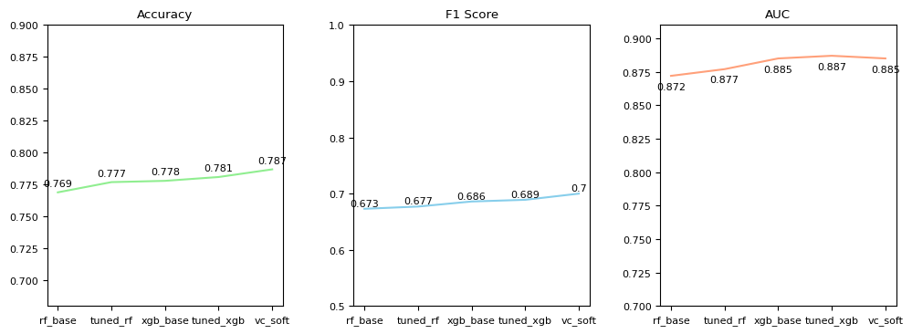
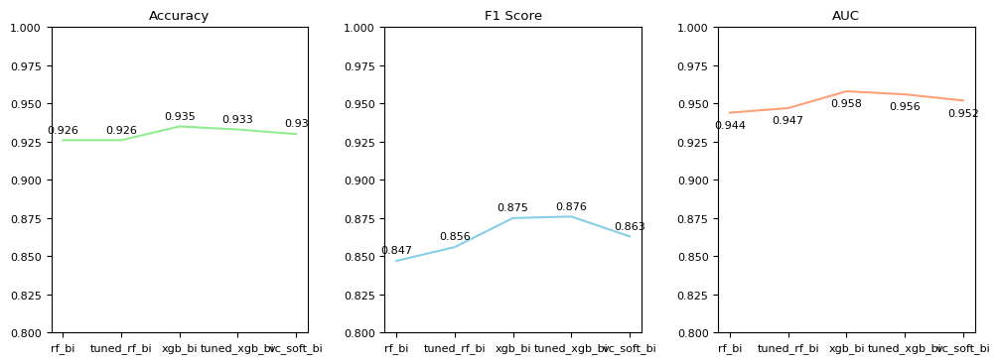
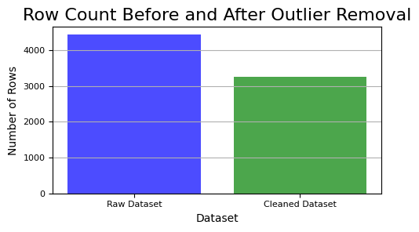
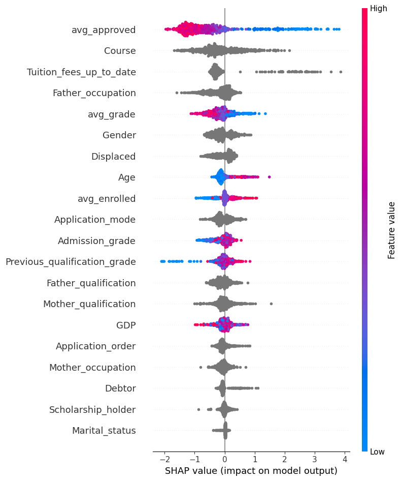
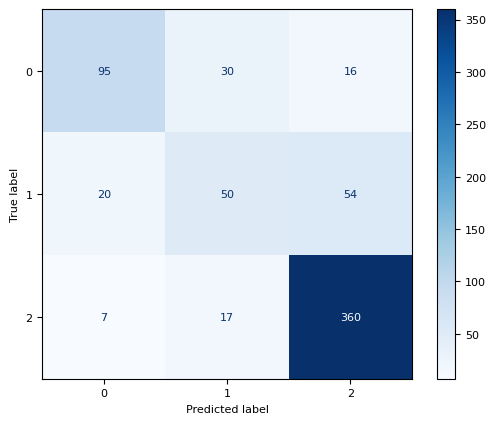
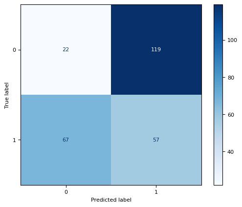

# ExplainEDU: Predicting Student Dropout and Academic Success Using Machine Learning and Explainable AI

## 📈 Project Overview

Higher education institutions face challenges in identifying students who are at risk of dropping out or struggling academically. Early prediction of these outcomes can significantly improve retention strategies and student support systems. This project presents a machine learning-based solution that classifies student outcomes into three categories: **Graduate**, **Enrolled**, and **Dropout**, with a complementary binary classification for **Dropout vs. Non-Dropout**.

We implemented and compared multiple algorithms including **Random Forest**, **XGBoost**, and an **Ensemble Voting Classifier**, enhanced through hyperparameter tuning. The aim was to develop accurate and interpretable models that not only perform well but also provide insights understandable to academic stakeholders.

## 📊 Data Structure Overview

The dataset contains **4,000+ records** and **35 features** collected from a higher education institution. It includes:

| Column Name                                   | Type        | Description |
|-----------------------------------------------|-------------|-------------|
| Marital status                                | Categorical | Marital status of the student |
| Application mode                              | Categorical | Mode of application |
| Application order                             | Integer     | Order of application |
| Course                                        | Categorical | Course applied for |
| Daytime/evening attendance                    | Categorical | Attendance schedule |
| Previous qualification                        | Categorical | Prior educational qualification |
| Previous qualification (grade)                | Float       | Grade in previous qualification |
| Nacionality                                   | Categorical | Student nationality |
| Mother's qualification                        | Categorical | Educational qualification of mother |
| Father's qualification                        | Categorical | Educational qualification of father |
| Mother's occupation                           | Categorical | Occupation of mother |
| Father's occupation                           | Categorical | Occupation of father |
| Admission grade                               | Float       | Grade at admission |
| Displaced                                     | Boolean     | Displacement status |
| Educational special needs                     | Boolean     | Presence of special needs |
| Debtor                                        | Boolean     | Debt status |
| Tuition fees up to date                       | Boolean     | Whether tuition fees are paid |
| Gender                                        | Categorical | Gender |
| Scholarship holder                            | Boolean     | Whether the student holds a scholarship |
| Age at enrollment                             | Integer     | Age when enrolling |
| International                                 | Boolean     | Whether the student is an international student |
| Curricular units 1st sem (credited)           | Integer     | Number of units credited in the first semester |
| Curricular units 1st sem (enrolled)           | Integer     | Number of units enrolled in the first semester |
| Curricular units 1st sem (evaluations)        | Integer     | Number of units evaluated in the first semester |
| Curricular units 1st sem (approved)           | Integer     | Number of units approved in the first semester |
| Curricular units 1st sem (grade)              | Float       | Grades in the first semester |
| Curricular units 1st sem (without evaluations)| Integer     | Units in the first semester without evaluations |
| Curricular units 2nd sem (credited)           | Integer     | Number of units credited in the second semester |
| Curricular units 2nd sem (enrolled)           | Integer     | Number of units enrolled in the second semester |
| Curricular units 2nd sem (evaluations)        | Integer     | Number of units evaluated in the second semester |
| Curricular units 2nd sem (approved)           | Integer     | Number of units approved in the second semester |
| Curricular units 2nd sem (grade)              | Float       | Grades in the second semester |
| Curricular units 2nd sem (without evaluations)| Integer     | Units in the second semester without evaluations |
| Unemployment rate                             | Float       | Unemployment rate at the time |
| Inflation rate                                | Float       | Inflation rate at the time |
| GDP                                           | Float       | Gross Domestic Product |
| Target                                        | Categorical | Outcome label: Graduate, Enrolled, Dropout |

**Preprocessing steps included**:
- Outlier removal using IQR
- Feature selection (Chi-Square for categoricals, Spearman for numericals)
- Class balancing using SMOTE

## 📅 Executive Summary

This project builds predictive models for student outcomes with a focus on accuracy and interpretability. Multiclass classification distinguishes between *Graduate*, *Enrolled*, and *Dropout*, while binary classification focuses on *Dropout vs. Non-Dropout*.

- The **VotingClassifier** achieved **87% accuracy**, **F1 score of 0.70**, and an **AUC of 0.89** for multiclass classification. This means the model effectively balances precision and recall while making nuanced distinctions across three student statuses, making it suitable for academic tracking and intervention planning.

  
   <em>Figure 1: Multiclass Classification Accuracy</em>

- For binary classification, **XGBoost** achieved **94% accuracy**, **F1 score of 0.87**, and **AUC of 0.96** after tuning. These metrics reflect the model's strong ability to detect dropout cases with minimal false positives, making it ideal for early-warning systems.

  
   <em>Figure 2: Binary Classification Accuracy</em>

- After applying SMOTE and outlier removal, the model improved its **recall for dropout detection by 22%**, significantly reducing false negatives. In practice, this means more at-risk students were correctly identified, which is essential for timely support and retention strategies.

- Outlier handling using IQR removed approximately **18% of noisy data**, leading to a **3.8% increase in overall model accuracy**. This data cleaning step helped improve the model's stability and generalization by removing extreme values that distorted learning.

  
   <em>Figure 3: Impact of Outlier Removal</em>

- Hyperparameter tuning through **RandomizedSearchCV** improved XGBoost's **precision on dropout prediction from 0.82 to 0.89**, resulting in fewer false alarms and greater trust in the model among decision-makers.

Explainability was a core feature of the pipeline. Using **SHAP (SHapley Additive exPlanations)**, the models provided both global and individual-level insights into which features most influenced the predictions. These explanations bridge the gap between model complexity and stakeholder understanding, making the tool not just accurate but also actionable.

## 🔍 Insights Deep Dive

### Academic Metrics Are the Strongest Predictors
`avg_approved` and `avg_grade` were the top features driving predictions. These features significantly influenced both graduation and dropout outcomes across all models.

  
   <em>Figure 4: SHAP Summary showing global feature importance</em>

### Attendance as a Leading Indicator
Low attendance was consistently linked with higher dropout risk. This suggests it can serve as an early-warning metric for interventions.

  
   <em>Figure 5: SHAP Summary showing detailed feature importance</em>

### Financial Stress Factors
Features such as `tuition_fees_up_to_date` and `father_occupation` showed notable impact in individual dropout cases, indicating the role of socioeconomic stress in academic disengagement.

### Model Task Comparison
The multiclass model is valuable for monitoring institution-wide trends, while the binary model is more actionable for targeted support.

  
  

  <em>Figure 6 & 7: Left - Confusion Matrix for Multiclass Classification | Right - Confusion Matrix for Binary Classification</em>

### Explainability Enhances Trust
SHAP force plots were used to explain individual predictions, making the system suitable for academic advisors and administrative decision-makers.

## 🔄 Recommendations

1. **Deployment**: Convert the model into a web dashboard for live student risk tracking.
2. **Data Expansion**: Integrate behavioral and mental health data to enhance prediction accuracy.
3. **Scalability**: Apply the pipeline to other institutions for generalized validation.
4. **Temporal Modeling**: Explore LSTM or Transformer-based models for semester-wise performance forecasting.

## 📄 Research Paper

This project, **ExplainEDU**, is a practical implementation and extension of the methodologies and findings described in our comprehensive research paper.

The paper provides:
- A detailed analysis of the challenges faced by higher education institutions in predicting student dropout.
- The complete machine learning workflow, including data preprocessing, feature selection, model tuning, and evaluation metrics.
- An in-depth exploration of model explainability using SHAP values to interpret predictions for both technical and non-technical audiences.

🔗 [**Read the Full Research Paper (PDF)**](docs/ExplainEDU_Research_Paper.pdf)
